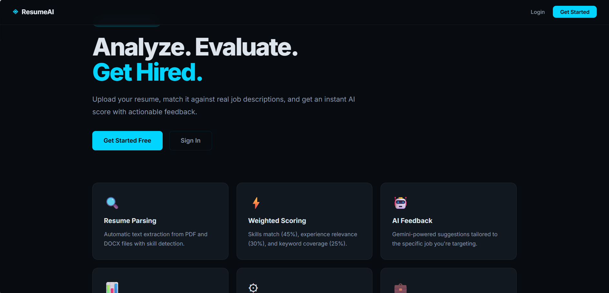
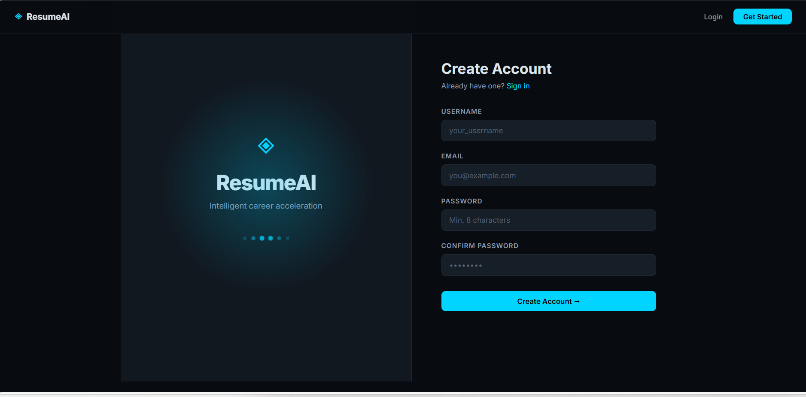
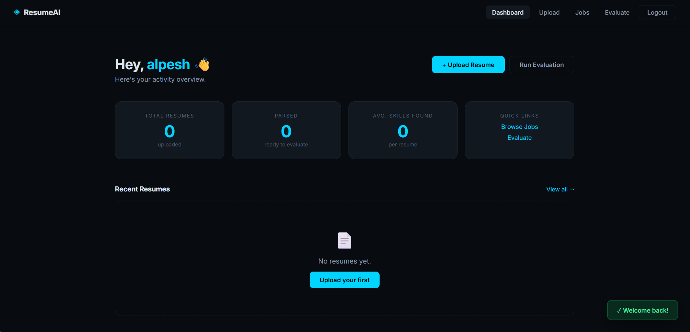
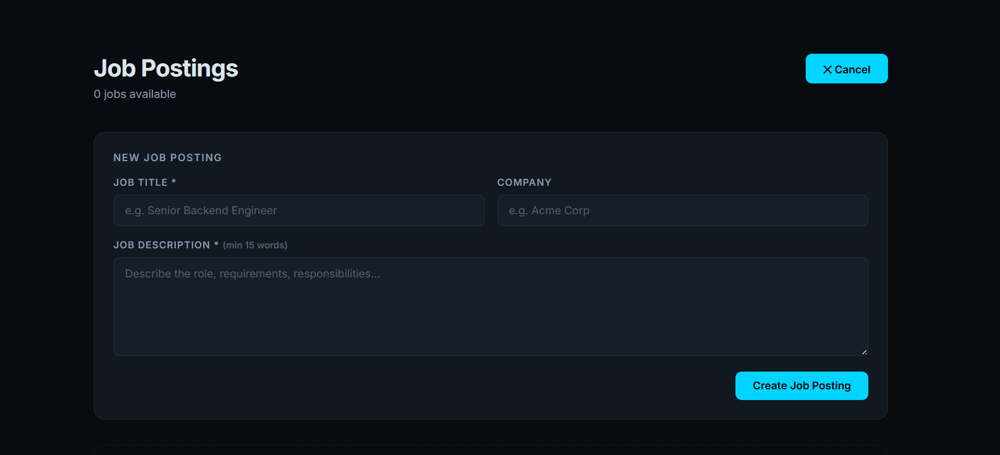
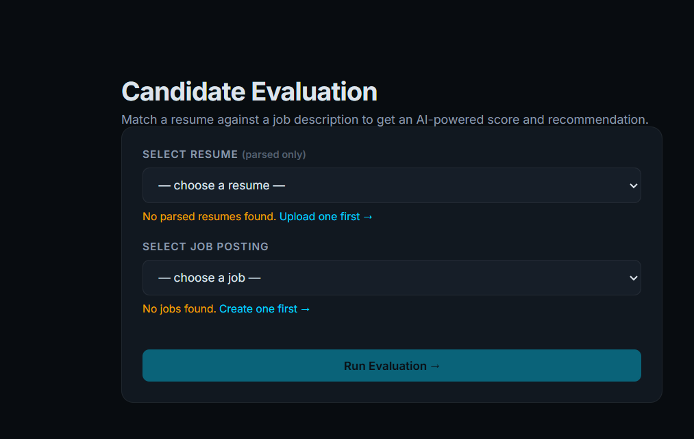

<div align="center">

<h1>
  
</h1>

<p align="center">
  <strong>An AI-powered resume analysis and candidate evaluation platform</strong><br/>
  Built with Flask · React · MySQL · Redis · Celery · Google Gemini AI
</p>

<p align="center">
  
  
  
  
  
  
  
</p>

<p align="center">
  
  
  
  
</p>

</div>

---

## 📌 Problem Statement

Most candidates apply to jobs without knowing how well their resume actually matches the job description.
Traditional ATS (Applicant Tracking Systems) reject resumes silently — no feedback, no score, no explanation.

**ResumeAI solves this by:**
- Parsing your resume and extracting real skills
- Comparing it against any job description
- Returning a 0–100 match score with a clear **Hire / Improve / Reject** recommendation
- Providing AI-generated, actionable improvement feedback via Google Gemini

---

## ✨ Features

| Feature | Description |
|--------|-------------|
| 📄 **Resume Upload** | Supports PDF and DOCX file formats up to 10 MB |
| 🔍 **Resume Parsing** | Extracts text and skills from uploaded resumes asynchronously |
| 🧠 **Skill Extraction** | Identifies 50+ technical skills using regex + taxonomy matching |
| 📊 **ATS Scoring** | Weighted scoring engine returns a 0–100 match score |
| 💼 **Job Evaluation** | Evaluates any resume against any job description |
| 🤖 **AI Feedback** | Gemini AI generates personalized, bullet-point improvement tips |
| ⚡ **Async Processing** | Celery workers handle parsing and scoring in the background |
| 🗃️ **Redis Caching** | Evaluation results cached 24h — no redundant AI API calls |
| 🔐 **Authentication** | Secure session-based auth with bcrypt password hashing |
| 📋 **Job Management** | Create, browse, and delete job postings with auto skill extraction |
| 📱 **Responsive UI** | Modern dark-theme React SPA, mobile-friendly |
| 🏗️ **Clean Architecture** | Layered backend: controllers → services → repositories → validators |

---

## 🏗️ System Architecture

```
┌─────────────────────────────────────────────────────────────────┐
│                        CLIENT (React SPA)                        │
│           Login · Dashboard · Upload · Jobs · Evaluate           │
└───────────────────────────┬─────────────────────────────────────┘
                            │ HTTP / REST (axios)
┌───────────────────────────▼─────────────────────────────────────┐
│                      FLASK REST API                              │
│  ┌──────────────┐  ┌──────────────┐  ┌──────────────────────┐  │
│  │ Controllers  │  │   Services   │  │    Repositories       │  │
│  │ /auth        │  │ AuthService  │  │    UserRepo           │  │
│  │ /resume      │  │ ResumeService│  │    ResumeRepo         │  │
│  │ /job         │  │ JobService   │  │    JobRepo            │  │
│  │ /evaluation  │  │ EvalService  │  │    EvaluationRepo     │  │
│  └──────────────┘  └──────────────┘  └──────────────────────┘  │
└─────┬──────────────────────────┬────────────────────────────────┘
      │                          │
      ▼                          ▼
┌──────────┐            ┌────────────────────────────────────────┐
│  MySQL   │            │        Redis                           │
│  users   │            │  ┌──────────────┐  ┌───────────────┐  │
│  resumes │            │  │ Celery Broker│  │  Result Cache │  │
│  jobs    │            │  │ Task Queue   │  │  TTL: 24h     │  │
│  evals   │            │  └──────┬───────┘  └───────────────┘  │
└──────────┘            └─────────┼──────────────────────────────┘
                                  │
                    ┌─────────────▼──────────────┐
                    │      CELERY WORKERS         │
                    │  ┌─────────────────────┐   │
                    │  │  parse_resume_task  │   │
                    │  │  run_eval_task      │   │
                    │  └─────────────────────┘   │
                    │            │                │
                    │            ▼                │
                    │   Google Gemini AI API      │
                    └────────────────────────────┘
```

### Async Request Flow

```
Client → POST /resume/upload
       ← 202 { resume_id, task_id }   (immediate)
         Celery parses PDF in background
Client → GET /resume/task/{task_id}
       ← { status: "completed" }      (poll every 2s)

Client → POST /evaluation/
       ← 202 { eval_id, task_id }     (immediate, or 200 if cached)
         Celery scores + calls Gemini
Client → GET /evaluation/{eval_id}
       ← { score: 78.4, recommendation: "Hire", ... }
```

---

## 🧮 Scoring Algorithm

The evaluation engine uses a **weighted 3-factor scoring model**:

```
Total Score = (Skills Match × 0.45) + (Experience Relevance × 0.30) + (Keyword Coverage × 0.25)
```

| Factor | Weight | Method |
|--------|--------|--------|
| **Skills Match** | 45% | Jaccard similarity between resume skills and JD skills |
| **Experience Relevance** | 30% | Action-verb signal overlap + resume detail bonus |
| **Keyword Coverage** | 25% | TF-weighted keyword frequency match |

**Recommendation thresholds:**

| Score | Recommendation |
|-------|---------------|
| ≥ 75  | ✅ Hire |
| 45–74 | ⚠️ Improve |
| < 45  | ❌ Reject |

---
## Screenshots

### Home Page


### Register Page


### Dashboard


### Upload Resume


### Job Management


### Evaluation Result


---

## 🛠️ Tech Stack

### Backend
| Technology | Purpose |
|-----------|---------|
| **Python 3.11+** | Core language |
| **Flask 3.0** | REST API framework |
| **SQLAlchemy 2.0** | ORM and database abstraction |
| **Pydantic v2** | Request validation and schema enforcement |
| **bcrypt** | Password hashing |
| **Celery 5.3** | Distributed task queue |
| **pdfminer.six** | PDF text extraction |
| **python-docx** | DOCX text extraction |
| **Google Gemini AI** | AI-generated resume feedback |

### Frontend
| Technology | Purpose |
|-----------|---------|
| **React 18** | SPA framework |
| **React Router v6** | Client-side routing |
| **Axios** | HTTP client with credential support |
| **CSS3** | Custom dark-theme design system |

### Infrastructure
| Technology | Purpose |
|-----------|---------|
| **MySQL 8.0** | Primary relational database |
| **Redis 7.0** | Celery broker + result caching |
| **Gunicorn + Gevent** | Production WSGI server |

---

## 📁 Folder Structure

```
ResumeAI/
│
├── backend/                         # Flask API
│   ├── app.py                       # Application factory
│   ├── main.py                      # Entrypoint
│   ├── requirements.txt
│   ├── .env.example
│   │
│   ├── config/
│   │   └── settings.py              # All env-vars and constants
│   │
│   ├── models/
│   │   └── orm.py                   # SQLAlchemy models (User, Resume, Job, Evaluation)
│   │
│   ├── controllers/                 # HTTP layer only
│   │   ├── auth_controller.py       # /auth/*
│   │   ├── resume_controller.py     # /resume/*
│   │   ├── job_controller.py        # /job/*
│   │   └── evaluation_controller.py # /evaluation/*
│   │
│   ├── services/                    # Business logic
│   │   ├── auth_service.py
│   │   ├── resume_service.py
│   │   ├── job_service.py
│   │   ├── evaluation_service.py    # Core scoring engine
│   │   └── evaluation_orchestrator.py
│   │
│   ├── repositories/                # Database access
│   │   ├── user_repo.py
│   │   ├── resume_repo.py
│   │   ├── job_repo.py
│   │   └── evaluation_repo.py
│   │
│   ├── validators/
│   │   └── schemas.py               # Pydantic v2 request schemas
│   │
│   ├── workers/
│   │   └── tasks.py                 # Celery app + background tasks
│   │
│   ├── utils/
│   │   ├── auth.py                  # @login_required decorator
│   │   ├── cache.py                 # Redis client + key strategy
│   │   ├── database.py              # db_session() context manager
│   │   ├── errors.py                # Exception hierarchy
│   │   ├── file_parser.py           # PDF/DOCX extraction
│   │   └── logger.py                # Structured JSON logging
│   │
│   └── tests/
│       ├── test_auth_service.py
│       ├── test_evaluation_service.py
│       └── test_resume_service.py
│
└── frontend/                        # React SPA
    ├── package.json
    ├── .env.example
    └── src/
        ├── App.js                   # Router + layout
        ├── index.js                 # React entry point
        ├── styles.css               # Full design system
        ├── api/
        │   └── client.js            # Axios + all API calls
        ├── context/
        │   └── AuthContext.js       # Global auth state
        ├── hooks/
        │   └── usePolling.js        # Async task polling
        ├── components/
        │   └── UI.js                # Nav, Card, Btn, Toast, ScoreRing…
        └── pages/
            ├── Home.js
            ├── Login.js
            ├── Register.js
            ├── Dashboard.js
            ├── ResumePage.js
            ├── JobsPage.js
            ├── EvaluatePage.js
            └── ProfilePage.js
```

---

## ⚙️ Installation

### Prerequisites

- Python 3.11+
- Node.js 18+
- MySQL 8.0
- Redis 7.0

---

### 1. Clone the Repository

```bash
git clone https://github.com/alpeshborekar/ResumeAI.git
cd ResumeAI
```

---

### 2. Backend Setup

```bash
cd backend

# Create and activate virtual environment
python -m venv venv
source venv/bin/activate        # Windows: venv\Scripts\activate

# Install dependencies
pip install -r requirements.txt

# Copy and configure environment variables
cp .env.example .env
# Edit .env with your credentials (see section below)
```

---

### 3. Database Setup

```sql
-- Run in MySQL
CREATE DATABASE ai_resume CHARACTER SET utf8mb4 COLLATE utf8mb4_unicode_ci;
CREATE USER 'ai_resume_user'@'localhost' IDENTIFIED BY 'your_password';
GRANT ALL PRIVILEGES ON ai_resume.* TO 'ai_resume_user'@'localhost';
FLUSH PRIVILEGES;
```

Tables are created automatically when the Flask app starts (`init_db()`).

---

### 4. Frontend Setup

```bash
cd frontend
npm install
cp .env.example .env
# Edit REACT_APP_API_URL if needed
```

---

## 🔐 Environment Variables

### Backend — `backend/.env`

```env
# Flask
SECRET_KEY=your-strong-random-secret-key
FLASK_DEBUG=false
UPLOAD_DIR=temp
MAX_UPLOAD_MB=10
LOG_LEVEL=INFO
LOG_FILE=logs/app.log

# MySQL
MYSQL_HOST=localhost
MYSQL_PORT=3306
MYSQL_USER=ai_resume_user
MYSQL_PASSWORD=your_db_password
MYSQL_DB=ai_resume
DB_POOL_SIZE=10

# Redis
REDIS_HOST=localhost
REDIS_PORT=6379
REDIS_DB=0

# Google Gemini AI
GEMINI_API_KEY=your_gemini_api_key
GEMINI_MODEL=gemini-2.0-flash

# Email (optional)
MAIL_USERNAME=your@gmail.com
MAIL_PASSWORD=your_app_password
```

### Frontend — `frontend/.env`

```env
REACT_APP_API_URL=http://localhost:5000
```

---

## 🚀 Running the Project

### Development Mode (3 terminals)

**Terminal 1 — Flask API**
```bash
cd backend
source venv/bin/activate
python main.py
# API running at http://localhost:5000
```

**Terminal 2 — Celery Worker**
```bash
cd backend
source venv/bin/activate
celery -A workers.tasks.celery_app worker --loglevel=info --concurrency=4
```

**Terminal 3 — React Frontend**
```bash
cd frontend
npm start
# App running at http://localhost:3000
```

### Run Tests

```bash
cd backend
pytest tests/ -v --tb=short
```

---

## 🌐 API Endpoints

### Authentication
| Method | Endpoint | Description |
|--------|----------|-------------|
| `POST` | `/auth/register` | Create new account |
| `POST` | `/auth/login` | Start session |
| `POST` | `/auth/logout` | End session |
| `GET`  | `/auth/me` | Current user info |
| `POST` | `/auth/change-password` | Update password |

### Resume
| Method | Endpoint | Description |
|--------|----------|-------------|
| `POST` | `/resume/upload` | Upload PDF or DOCX |
| `GET`  | `/resume/{id}` | Get resume metadata |
| `GET`  | `/resume/` | List user's resumes |
| `GET`  | `/resume/task/{task_id}` | Poll parse status |

### Jobs
| Method | Endpoint | Description |
|--------|----------|-------------|
| `POST` | `/job/` | Create job posting |
| `GET`  | `/job/` | List all jobs |
| `GET`  | `/job/{id}` | Get single job |
| `DELETE` | `/job/{id}` | Delete job (creator only) |

### Evaluation
| Method | Endpoint | Description |
|--------|----------|-------------|
| `POST` | `/evaluation/` | Submit evaluation |
| `GET`  | `/evaluation/{id}` | Get result or status |
| `GET`  | `/evaluation/task/{task_id}` | Poll eval status |

### Responses

**202 Accepted** (async job queued):
```json
{
  "resume_id": 12,
  "task_id": "abc-123-def",
  "status": "pending"
}
```

**200 OK** (evaluation completed):
```json
{
  "evaluation_id": 7,
  "status": "completed",
  "total_score": 78.4,
  "skills_score": 83.3,
  "experience_score": 71.0,
  "keyword_score": 76.5,
  "matched_skills": ["python", "flask", "docker", "postgresql"],
  "missing_skills": ["terraform", "kubernetes"],
  "recommendation": "Hire",
  "reasoning": "Overall match score: 78.4/100. Skills alignment: 83.3/100 (strong)...",
  "ai_feedback": "1. Add quantified achievements to your experience section...",
  "completed_at": "2025-05-14T10:32:11"
}
```

---

## 🚢 Deployment

### Production (Gunicorn + Nginx)

```bash
# Start Flask with Gunicorn (4 async workers)
gunicorn "main:app" \
  -w 4 -k gevent \
  --bind 0.0.0.0:5000 \
  --timeout 120 \
  --access-logfile logs/access.log

# Start Celery worker
celery -A workers.tasks.celery_app worker \
  --loglevel=warning \
  --concurrency=8 \
  --logfile=logs/celery.log

# Build React for production
cd frontend && npm run build
# Serve /build with Nginx or any static host
```

### Docker (coming soon)

```bash
docker-compose up --build
```

---

## 📈 Redis Caching Strategy

| Key Pattern | TTL | Purpose |
|------------|-----|---------|
| `eval:{resume_id}:{job_id}` | 24 hours | Avoid recomputing evaluations |
| `resume:meta:{resume_id}` | 6 hours | Fast resume GET without DB hit |
| `task:status:{task_id}` | 2 hours | Async task polling |

---

## 🔮 Future Improvements

- [ ] **Docker Compose** — one-command full stack startup
- [ ] **JWT-based stateless auth** — replace session with access + refresh tokens
- [ ] **Resume PDF export** — download evaluation report as PDF
- [ ] **Bulk evaluation** — evaluate multiple resumes against one JD simultaneously
- [ ] **Admin dashboard** — platform-wide analytics and user management
- [ ] **WebSocket status updates** — replace polling with real-time push notifications
- [ ] **CI/CD pipeline** — GitHub Actions for automated testing and deployment
- [ ] **Skill taxonomy API** — plug in a real skills database (ESCO / LinkedIn Skills)
- [ ] **Rate limiting** — protect AI endpoints from abuse

---

## 💼 Project Highlights

- **Clean layered architecture** — controllers, services, repositories, validators are strictly separated. Zero business logic in controllers, zero HTTP code in services.
- **Async-first design** — no endpoint blocks on I/O. File parsing and AI calls always go through Celery workers; the API responds in < 50ms regardless of AI latency.
- **Cache-first evaluation** — Redis lookup happens before any DB query. Identical resume–job pairs never hit the scoring engine twice.
- **Fault-tolerant workers** — `acks_late=True` ensures tasks survive worker crashes and get retried automatically (3× for parsing, 2× for evaluation).
- **Centralized error handling** — a single Flask error handler converts every `AppError` subclass to a consistent JSON response. No try/catch scattered across controllers.
- **Structured JSON logging** — every request, slow query (> 500ms), and worker event is logged in JSON format — ready to ingest into any log platform.
- **Pydantic v2 validation** — all request bodies are validated before touching a service. Invalid input never reaches business logic.

---

## 🤝 Contributing

Contributions are welcome!

```bash
# Fork the repo, then:
git checkout -b feature/your-feature-name
git commit -m "feat: add your feature"
git push origin feature/your-feature-name
# Open a Pull Request
```

Please keep PRs focused and include tests for new features.

---
---

<div align="center">

**Built by [Alpesh Borekar](https://github.com/alpeshborekar)**

⭐ Star this repo if you found it useful — it helps others discover it!

</div>
